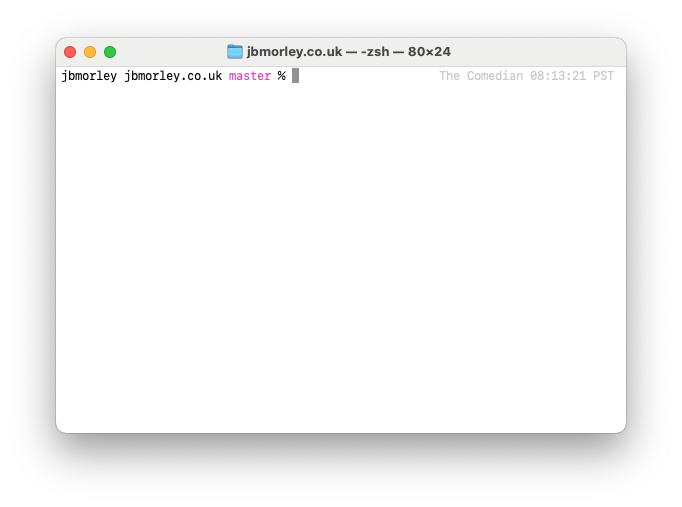

> [!IMPORTANT]
> 
> This project has been archived and will not be maintained or developed further.
>
> There exist many more comprehensive alternatives to Zsh customization such as [Oh My Zsh](https://ohmyz.sh), and better mechanisms for sharing configurations between systems such as [chezmoi](https://www.chezmoi.io).

# configure-prompt

Minimal prompt for Zsh



## Features

- current working directory
- active branch
- hostname
- timestamp

## Usage

1. Clone the repository:

   ```zsh
   mkdir -p ~/Projects
   cd ~/Projects
   git clone git@github.com:jbmorley/configure-prompt.git
   ```

2. Add the following lines to `~/.zshrc`:

   ```zsh
   FPATH="$FPATH:$HOME/Projects/configure-prompt"
   autoload configure-prompt
   configure-prompt
   ```
   
   You can optionally provide a custom machine name by specifying it as the first argument to `configure-prompt`:
   
   ```zsh
   configure-prompt "The Comedian"
   ```

The above instructions assume you want to clone the project to `~/Projects/configure-prompt`, which is where I like to keep all my projects and git checkouts. Feel free to change this path if you'd like to place it somewhere else.
